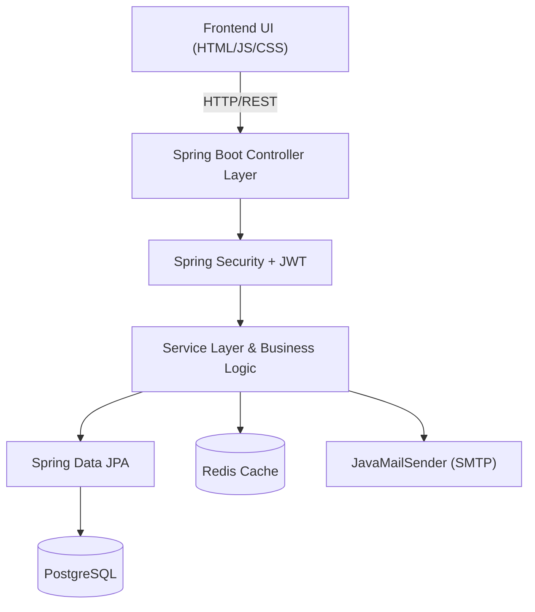

# Regulatory Penalty Tracker

A modern, full-stack application designed to track, manage, and report regulatory penalties. Built with Spring Boot (Java 17), PostgreSQL, Redis, and an elegant Glassmorphism frontend UI.

## Architecture Diagram



## Features
- **Secure JWT Authentication**: Role-based access control and token validation.
- **Robust Caching**: Redis-backed API responses for hyper-fast pagination.
- **Automated Alerts**: Email notifications via SMTP for new penalties and daily scheduled reminders.
- **Database Migrations**: Managed seamlessly via Flyway.
- **Glassmorphism UI**: Beautiful, fully responsive Vanilla CSS frontend.
- **Dockerized Environment**: One-command setup encompassing APIs, databases, and caches.

##   Setup Steps

### Option 1: Docker Compose (Recommended)
You can run the entire application stack effortlessly using Docker.

1. Navigate to the project root directory.
2. Build and launch the stack:
   ```bash
   docker-compose up --build
   ```
3. The following services will be securely spun up and linked:
   - Backend API: `http://localhost:8080`
   - Postgres Database: `localhost:5432`
   - Redis: `localhost:6379`
4. Access the frontend UI by directly opening `frontend/index.html` in your web browser.

### Option 2: Local Development Setup
To run the backend independently without Docker orchestration:

1. Ensure you have **Java 17**, **Maven**, **PostgreSQL**, and **Redis** installed locally.
2. Create a Postgres database named `penalty_db`.
3. Set your environment variables (see the table below).
4. Run the backend locally:
   ```bash
   mvn clean spring-boot:run
   ```
5. Run the integration tests (uses isolated in-memory H2 DB):
   ```bash
   mvn test
   ```

## Environment Variables

Configure these variables in your environment or rely on the `.yml` defaults.

| Variable | Description | Default Value |
| -------- | ----------- | ------------- |
| `DB_URL` | Postgres JDBC URL | `jdbc:postgresql://localhost:5432/penalty_db` |
| `DB_USER` | Postgres Username | `postgres` |
| `DB_PASSWORD` | Postgres Password | `postgres` |
| `REDIS_HOST` | Redis Server Host | `localhost` |
| `REDIS_PORT` | Redis Server Port | `6379` |
| `REDIS_PASSWORD`| Redis Password | *(empty)* |
| `JWT_SECRET` | String Secret Key | `your_super_secret_key_which_should...` |
| `JWT_EXPIRATION_MS`| Token Expiration (ms) | `86400000` (24h) |
| `MAIL_HOST` | SMTP Host | `smtp.example.com` |
| `MAIL_PORT` | SMTP Port | `587` |
| `MAIL_USERNAME` | SMTP Auth Username | `user` |
| `MAIL_PASSWORD` | SMTP Auth Password | `password` |
| `ADMIN_EMAIL` | Inbox for Notification Alerts| `admin@example.com` |

## Initial Data Seeding
Upon the very first startup, the `DataSeeder` component will automatically populate the database with:
- **1 System Admin user** (credentials: `admin` / `admin`)
- **30 randomly generated regulatory penalties** across various statuses and severities.
